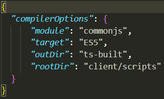
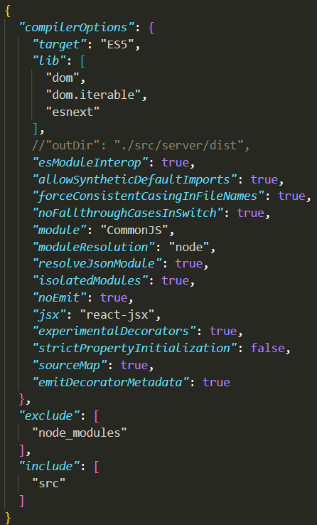
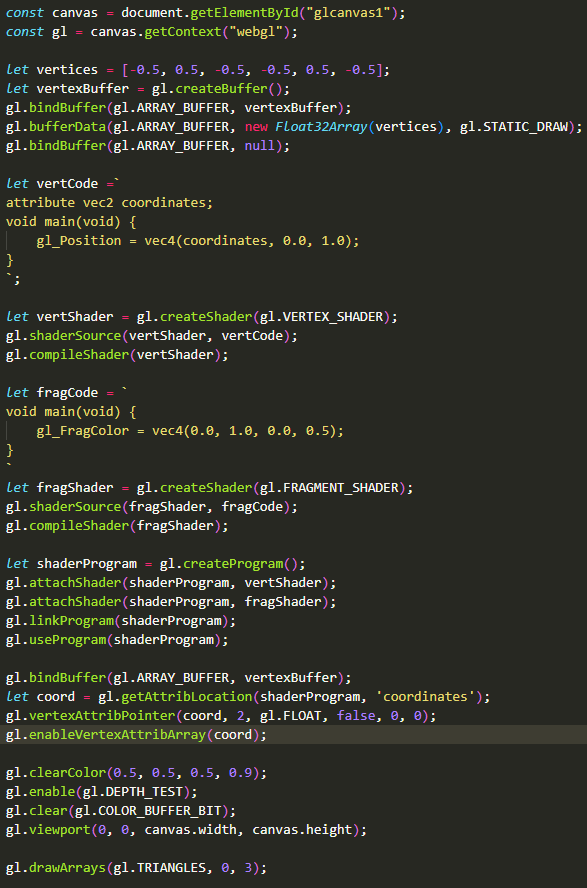
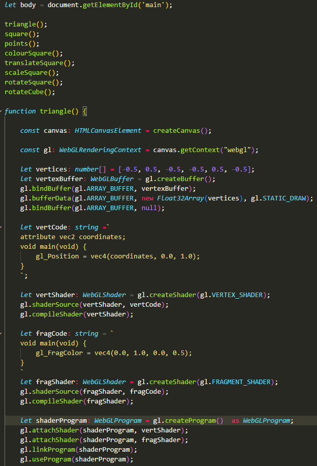

# A Learner's Guide to TypeScript
## Why Should You Learn TypeScript
Typescript is an incredibly versatile tool that is applicable in a large variety of fields: frontend and backend web development, database development, and more; its relative simplicity lends itself as a powerful, easy to learn extension of JavaScript. It makes code easier to follow as a variable's type is explicitly stated and as a result it can help you avoid coding errors as it will flag code that won't work with a given type, a feature that is non-existent with JavaScript's dynamic typing, in addition it also has built in checking functionality which can outline mistakes in code. The static, explicit typing of TypeScript also enables the use of code completion in IDE's such as VSCode as the IDE will always know exactly what type a variable is and thus will always know what is possible with a given variable or function. TypeScript serves as an extension of JavaScript and as a result, is equally as applicable as JavaScript since TypeScript can be translated into JavaScript meaning there are not many situations where using pure JavaScript will be more beneficial. TypeScript is compatibe with other systems and packages such as React, TypeORM, BootStrap, and more leading it to be very well-supported. It is also incredibly beginner-friendly whilst still being equally as viable in more complicated systems.

## Preliminary Information
Since TypeScript is an extension of JavaScript, it is only natural that at least baseline knowledge of JavaScript is required beforehand as all of the language's nuances and ideosyncrasies are inherited from JavaScript however if you forego this and start learning TypeScript directly, you will, in the process, also be learning JavaScript. W3Schools provides a good tutorial that introduces the core concepts of JavaScript that will be necessary to develop a TypeScript program (https://www.w3schools.com/js/DEFAULT.asp). The setting up, integration and application of the JavaScript however is still necessary information. You will need to have npm installed and will have to know how to create projects and install packages using npm as typescript is an npm package.

## Setting Up TypeScript
TypeScript has its own website (https://www.typescriptlang.org/) that details what TypeScript and outlines how to install it into your projects using npm or VSCode (https://www.typescriptlang.org/id/download).This webpage outlines how to install typescript into a project and how to set up a tsconfig file: https://www.w3schools.com/typescript/typescript_getstarted.php. TypeScript can be added just like any other npm package, once it's installed a tsconfig.json file can be added to the project and this file holds all the configurable settings for TypeScript in that project. The TypeScript website details the purpose (https://www.typescriptlang.org/docs/handbook/tsconfig-json.html) and settings (https://www.typescriptlang.org/tsconfig) of tsconfig.json but for the most part the default settings are all that is necessary for creating a functional project. When transpiling or compiling a project with TypeScript, TypeScript searches for and reads this file to know what TypeScript files to transpile and how to transpile them, certain files can be explicitly included or excluded from compilation and this can be specified in the tsconfig file, by default, all the settings are included in the file with descriptions of their purposes however most of them are commented out. I recommend reading through the descriptions of each of the settings as some are very useful and are suited for certain applications of TypeScript.

Examples of tsconfig.json files:

## Executing a TypeScript File
There are various ways to execute a TypeScript file (https://www.geeksforgeeks.org/how-to-execute-typescript-file-using-command-line/) (https://devimalplanet.com/how-to-build-and-run-typescript-watch-mode), if you transpile the file then I recommend creating a separate directory to hold all the transpiled files, the tsconfig file can then be modified to automatically add all the transpiled files to this new directory, I recommend doing this as when learning, you may make a large amount of TypeScript files so organising your files is always good practice. For smaller projects I recommend using the ts-node approach as it doesn't create additional files, it's quick to use and doesn't require any additional configuration, however for larger projects such as using TypeScript for web development, I recommend transpiling the files in watch mode and using nodemon as it is far more convenient for development as changes will be automatically transpiled and executed though it does require additional configuration.

## Using TypeScript
There are several tutorials that effectively teach the basics of TypeScript and the capabilities of its types (https://www.w3schools.com/typescript/index.php) (https://www.typescriptlang.org/docs/handbook/typescript-from-scratch.html) (https://www.tutorialspoint.com/typescript/index.htm), TypeScript is widespread enough that many common questions and issues have already been answered so using resources like stack overflow usually has the answer for more specific questions. There is also very useful and detailed documentation of TypeScript (https://www.typescriptlang.org/id/docs/) which also holds many answers for common problems. These tutorials introduce the core capabilities of TypeScript but they don't delve into more complicated use cases of these capabilities like with interfaces, enums, and new types; for this I recommend creating a larger project independently that can utilise all the taught aspects of TypeScript, such as a website that uses interfaces and such. This will help you gain further familiarity with the typing system as well as teach you a more practical useage of the language, creating a project without a tutorial is important as it tests you on how much of the language you have retained. If you have any JavaScript projects, try manually translating them into TypeScript to understand exactly how typing works; You can also use this as an opportunity to understand TypeScript's interactions with other packages and modules.

JavaScript code:

TypeScript code:

Try using TypeScript in as many projects as possible as this will keep reinforcing the information you have learnt, it may be useful to learn another skill whilst using TypeScript, like React (https://blog.logrocket.com/how-use-typescript-react-tutorial-examples/) or TypeORM (https://www.youtube.com/embed/JaTbzPcyiOE), so it becomes more natural to use. Follow a JavaScript tutorial but use TypeScript instead, start with basic tutorials (https://www.w3schools.com/Js/) and slowly move on to more complicated ones (https://developer.mozilla.org/en-US/docs/Learn/Getting_started_with_the_web/JavaScript_basics) all while using TypeScript and try changing it at points to utilise more independent knowledge.

At this point you should be familiar with the basics TypeScript however there are more advanced features that haven't been touched on yet and these are in the references section of the documentation (https://www.typescriptlang.org/docs/handbook/utility-types.html), create a project utilising these more advanced concepts. Go back to previous projects and try find instances where these can be used instead, if there are any problems, the documentation is a good resource to check as it thoroughly outlines the purpose and interactions of each concept.

https://www.youtube.com/embed/eJ6R1knfsoc

This video explains these advanced concepts in more detail whilst still being succinct but actually implementing these independently will help the most for reinforcement, recreate the code snippets in the video and change different aspects of the code to understand what changing each aspect does as this will help you understand how everything works more thoroughly. Asynchronous functions and interfaces are an incredibly useful and important part of the language so these are important to properly understand.

## Evaluation
In conclusion, TypeScript is an incredibly powerful and easy to learn extension of JavaScript that is almost always more viable than JavaScript, providing access to features such as interfaces and static typing allowing for smoother IDE integration and greater object oriented design in code. There aren't many other alternatives that are as universal and versatile as TypeScript, especially ones as easy to learn. TypeScript is also a commonly used language in the software development industry furthering its usefulness. Learning TypeScript also allows you to further your JavaScript knowledge so even if TypeScript is not desirable for a given situation, JavaScript is still available. Overall, learning TypeScript is very beneficial and requires minimal effort to learn to a useful level.