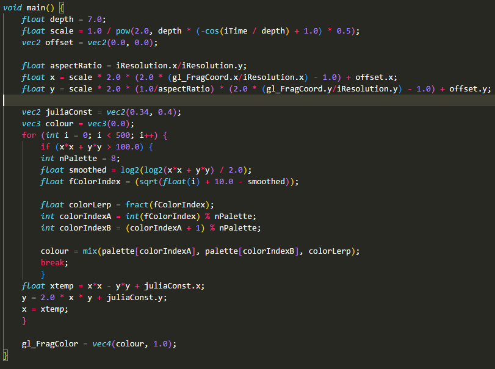
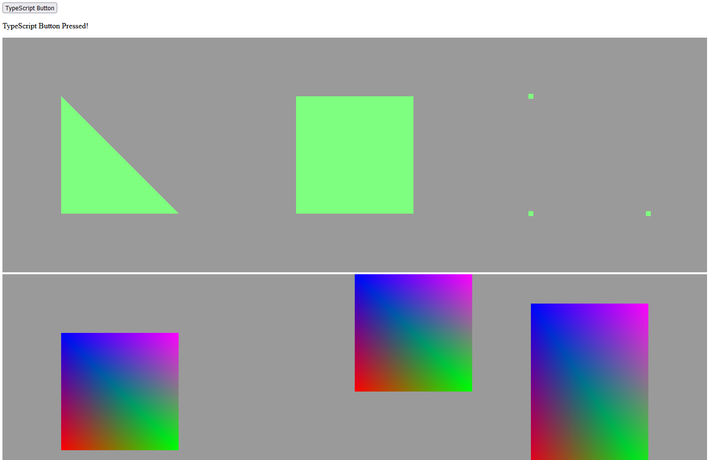
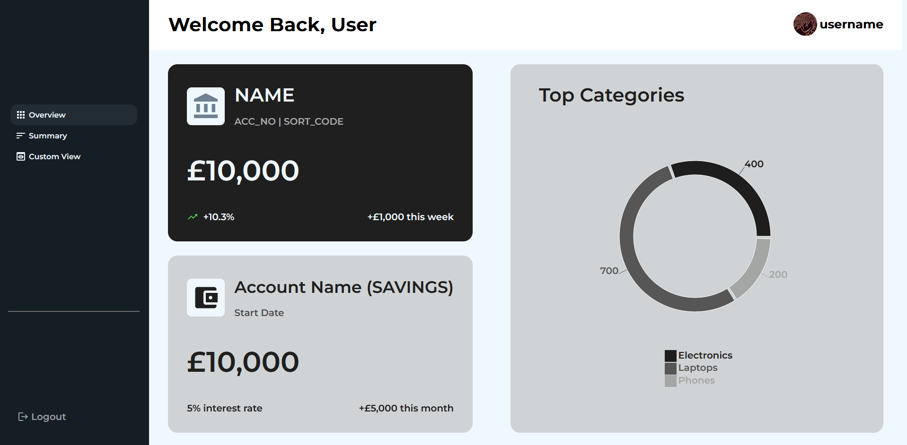

# Programming Black Assignment 2 Learning Log
## Entry 1 - 24/02/23
For the past 2 weeks I have been researching OpenGL and WebGL, I want to learn how to properly process graphics using the GPU to create fast renderings. I started out by creating fragment shaders using OpenGL in VSCode using a shader extension but I then moved onto WebGL to create a simple website hosting shaders.

I started my research by using a website 'The Book Of Shaders' (https://thebookofshaders.com/), this website holds several articles that outline how fragment shaders work. Using the website, I was able to graph and animate several functions such as sin, cos and a triangle wave. I was then able to implement colours by creating coloured lines for the graphs allowing me to map several functions onto one graph as well as add a coloured gradient background.

Animated graph of sin, cos and tan using different colours and an animated graph of a triangle wave:

I then decided I wanted to map fractals using shaders as I knew they are more suited for it and as a result I started researching the mandelbrot set and how to create a shader for it. I used a variety of websites to learn how to implement a Mandelbrot set into a shader (https://arnestenkrona.github.io/blog/2021/03/04/Mandelbrot-in-Shadertoy) (https://arukiap.github.io/fractals/2019/06/02/rendering-the-mandelbrot-set-with-shaders.html) (https://physicspython.wordpress.com/2020/02/16/visualizing-the-mandelbrot-set-using-opengl-part-1/). After following these websites and learning how the Mandelbrot set functions, I was able to create and animate the set using a fragment shader. I then tried using this knowledge to create a Julia Set as it's very similar to the Mandelbrot set.

Animated Mandelbrot set:

Animated Julia set:

Afterwards, I tried mapping the Tinkerbell map (https://en.wikipedia.org/wiki/Tinkerbell_map) only using the knowledge I had gained from the research I had done previously and then I decided to map another chaotic map, the Bogdanov map (https://en.wikipedia.org/wiki/Bogdanov_map), through similar means. I was able to implement both of these although they both cause the computer to slow after a certain number of points are plotted, so I will have to improve my shader further.

Animated Tinkerbell map and Bogdanov map:

As I am more familiar with fragment shaders, I decided to implement my new knowledge using WebGL. To do this, I followed the instructions on the websites (https://www.tutorialspoint.com/webgl/index.htm) (https://developer.mozilla.org/en-US/docs/Web/API/WebGL_API/Tutorial) (https://webglfundamentals.org/). Using the websites, I learnt how to use buffers and I learnt how geometry is rendered, allowing me to create a basic website that displays several shaders and shapes. Once I learned how to create geometry, I learned how to add fragment shaders to this geometry and how to transform these with linear maps allowing me to translate, scale and rotate the vertices. Finally I created a cube and animated its rotation using the skills I had learned from my research but I couldn't fix the cube from distorting when it rotates on a non-standard axis. I will have to research more on WebGL transformations to fix this deformation.

Website holding the WebGL geometry and shaders showing transformation and colouring of 2D and 3D objects:

I then browsed stack overflow, reddit and godot forums for questions I could answer and I found a couple questions about the Godot game engine that I was able to answer (https://stackoverflow.com/questions/75504631/godot-set-of-attack-movements/75510424#75510424) (https://www.reddit.com/r/godot/comments/119yull/moving_platform_apply_velocity_not_working) (https://www.reddit.com/r/godot/comments/119gwdi/3d_movement_question/) (https://godotforums.org/d/32861-weird-reaction-in-body-entered-signal/2) My username on stack overflow and godot forums is Cavlon and on reddit it is CavlonDeCadlon.

Next I plan on learning how to properly transform 3D shapes and apply more complex fragment shaders to them as well as adding interactivity.

## Entry 2 - 05/03/23
This past week, I found a group that I can work collaboratively with, together we plan on making a mock banking website using TypeScript and React (https://github.com/LMC-Enjoyers/Mock-Banking-Website). We also plan on implementing an SQL database in the future. As a result, I have decided to change my focus away from shaders and instead research these. First, I used a tutorial to learn the basics of Typescript (https://www.w3schools.com/typescript/index.php) and as a result I managed to convert my JavaScript shader site into TypeScript. I found It relatively simple however I found the installation and compilation process confusing and frustrating.

I then decided to try and create the frontend for our banking site using React as I am comfortable with TypeScript now. I followed several tutorials and referred to the documentation to create an admin page according to the mockup design a team member made. At first I had great difficulty understanding how React worked as it seemed overly complex but I then became more confident and succefully made the page, without any interactibility however. Once completed, I then made a pull request which was then accepted. It took a while to properly understand the component heavy nature of react and setting it up was difficult but I managed it in the end. My next goal is to add functionality to the frontend so it can be ready to connect to the backend later. The UI also doesn't dynamically resize for different window sizes so this needs to be fixed.

Sources:
https://www.tutorialspoint.com/reactjs-how-to-create-a-pie-chart-using-recharts,
https://www.youtube.com/watch?v=aTPkos3LKi8,
https://reactjs.org/docs/getting-started.html,
https://developer.mozilla.org/en-US/docs/Learn/Tools_and_testing/Client-side_JavaScript_frameworks/React_getting_started

Mockup:

My design with React and TypeScript:

