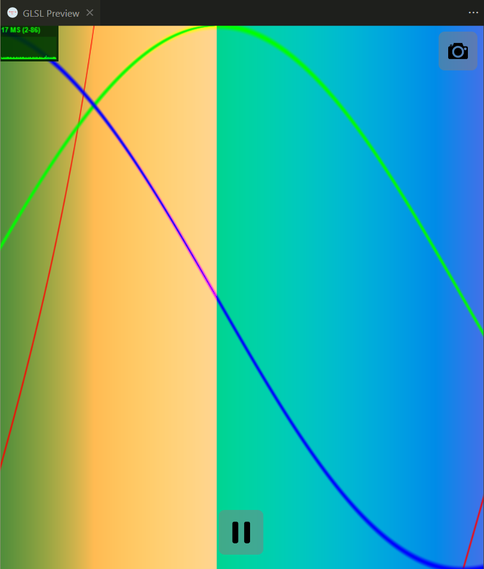
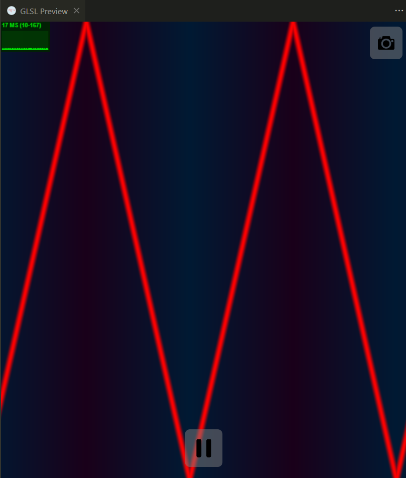
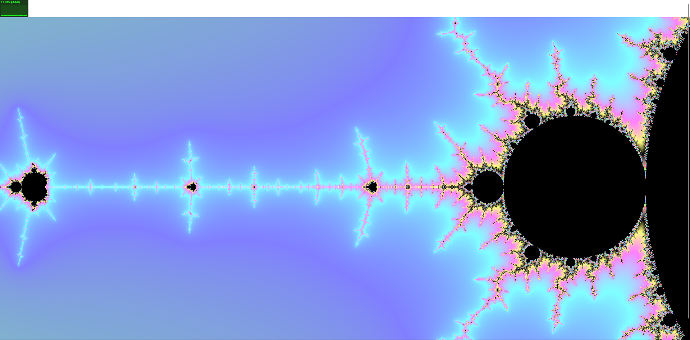
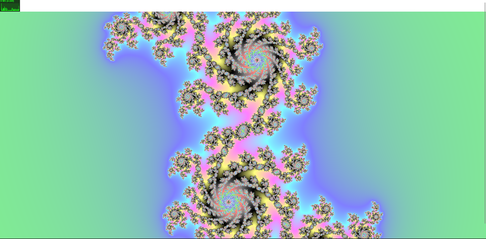
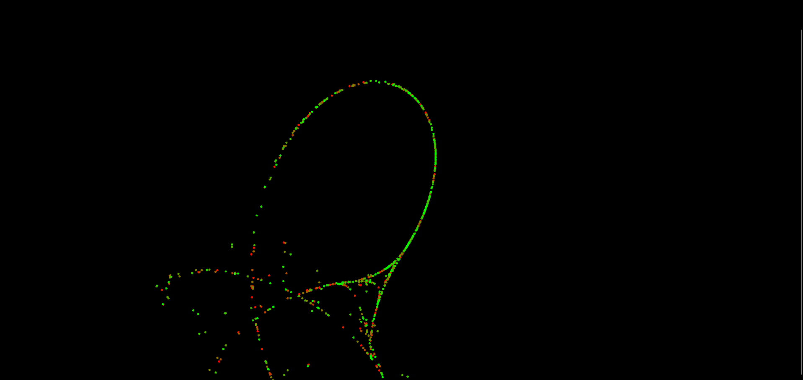
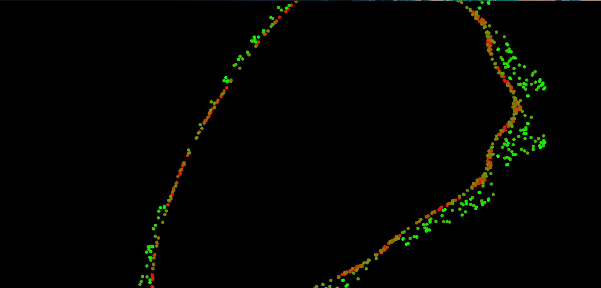
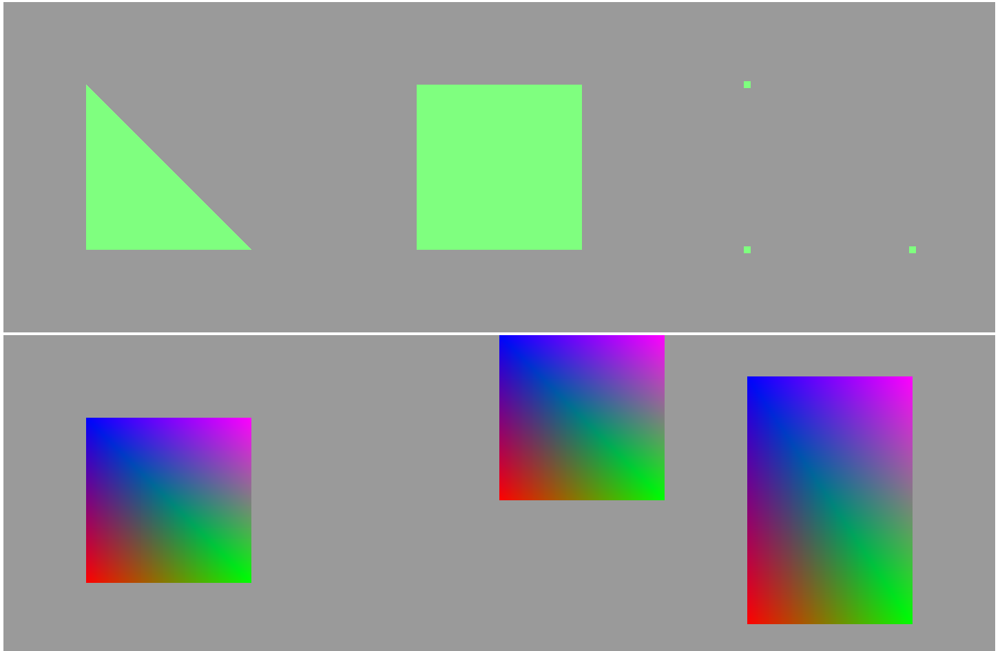
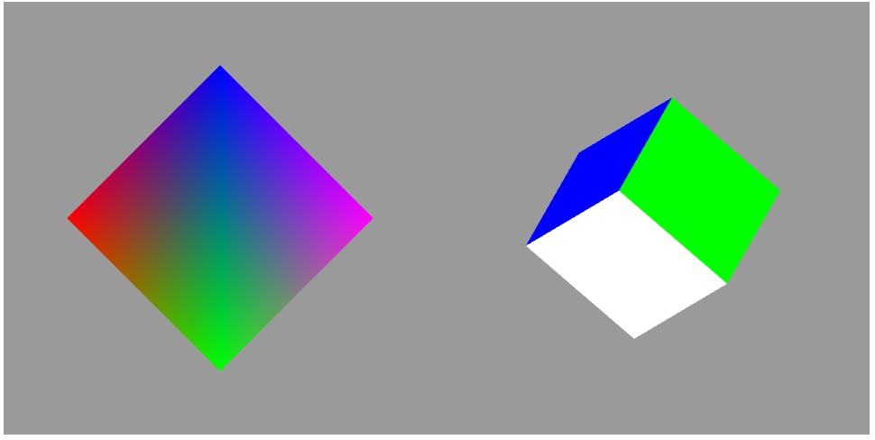

# Programming Black Assignment 2 Learning Log
## Entry 1 - 24/02/23
For the past 2 weeks I have been researching OpenGL and WebGL to try and learn processing using the GPU. I started out by creating fragment shaders using OpenGL in VSCode using a shader extension but I then moved onto WebGL to create a simple website hosting shaders.

I started my research by using a website 'The Book Of Shaders' (https://thebookofshaders.com/), this website holds several articles that outline how fragment shaders work. Using the website, I was able to graph and animate several functions such as sin, cos and a triangle wave. I was then able to implement colours by creating coloured lines for the graphs allowing me to map several functions onto one graph as well as add a coloured gradient background.

Animated graph of sin, cos and tan using different colours:

Animated graph of a triangle wave:

I then decided I wanted to map fractals using shaders as I knew they are more suited for it and as a result I started researching the mandelbrot set and how to create a shader for it. I used a variety of websites to learn how to implement a Mandelbrot set into a shader (https://arnestenkrona.github.io/blog/2021/03/04/Mandelbrot-in-Shadertoy) (https://arukiap.github.io/fractals/2019/06/02/rendering-the-mandelbrot-set-with-shaders.html) (https://physicspython.wordpress.com/2020/02/16/visualizing-the-mandelbrot-set-using-opengl-part-1/). After following these websites and learning how the Mandelbrot set functions, I was able to create and animate the set using a fragment shader. I then tried using this knowledge to create a Julia Set as it's very similr to the Mandelbrot set.

Animated Mandelbrot set:

Animated Julia set:

Afterwards, I tried mapping the Tinkerbell map (https://en.wikipedia.org/wiki/Tinkerbell_map) only using the knowledge I had gained from the research I had done previously and then I decided to map another chaotic map, the Bogdanov map, through similar means. I was able to implement both of these although they both cause the computer to slow after a certain number of points are plotted, so I will have to improve my shader further.

Animated tinkerbell map:

Animated bogdanov map:

As I am more familiar with fragment shaders, I decided to implement my new knowledge using WebGL. To do this, I followed the instructions on the websites (https://www.tutorialspoint.com/webgl/index.htm) (https://developer.mozilla.org/en-US/docs/Web/API/WebGL_API/Tutorial) (https://webglfundamentals.org/). Using the websites, I learnt how to use buffers and I learnt how geometry is rendered, allowing me to create a basic website that displays several shaders and shapes. Once I learned how to create geometry, I learned how to add fragment shaders to this geometry and how to transform these with linear maps allowing me to translate, scale and rotate the vertices. Finally I created a cube and animated its rotation using the skills I had learned from my research but I couldn't fix the cube from distorting when it rotates on a non-standard axis. I will have to research more on WebGL transformations to fix this deformation.

Website holding the WebGL geometry and shaders showing transformation and colouring of 2D and 3D objects:

I then browsed stack overflow, reddit and godot forums for questions I could answer and I found a couple questions about the Godot game engine that I was able to answer (https://stackoverflow.com/questions/75504631/godot-set-of-attack-movements/75510424#75510424) (https://www.reddit.com/r/godot/comments/119yull/moving_platform_apply_velocity_not_working) (https://www.reddit.com/r/godot/comments/119gwdi/3d_movement_question/) (https://godotforums.org/d/32861-weird-reaction-in-body-entered-signal/2) My username on stack overflow and godot forums is Cavlon and on reddit it is CavlonDeCadlon.